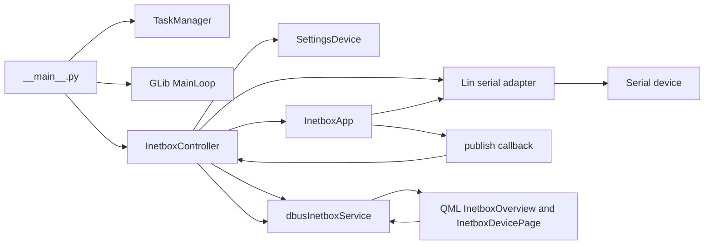
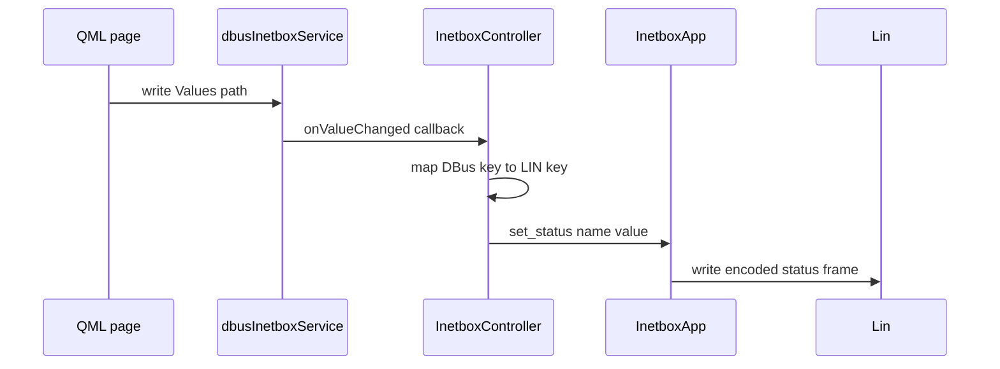
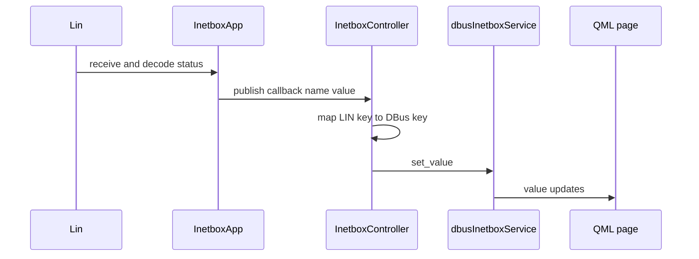

# dbus-inetbox Mermaid diagrams

## 1) Runtime architecture

## 2) Dbus write to device flow

## 3) Device telemetry publish flow

## Source anchors

- [src/opt/victronenergy/dbus-inetbox/__main__.py](../src/opt/victronenergy/dbus-inetbox/__main__.py)
- [src/opt/victronenergy/dbus-inetbox/inetbox_controller.py](../src/opt/victronenergy/dbus-inetbox/inetbox_controller.py)
- [src/opt/victronenergy/dbus-inetbox/inetboxapp.py](../src/opt/victronenergy/dbus-inetbox/inetboxapp.py)
- [src/opt/victronenergy/dbus-inetbox/dbus_services/dbus_inetbox_service.py](../src/opt/victronenergy/dbus-inetbox/dbus_services/dbus_inetbox_service.py)
- [src/opt/victronenergy/gui/qml/InetboxOverview.qml](../src/opt/victronenergy/gui/qml/InetboxOverview.qml)
