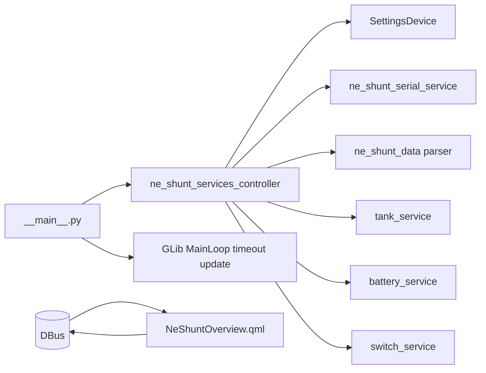
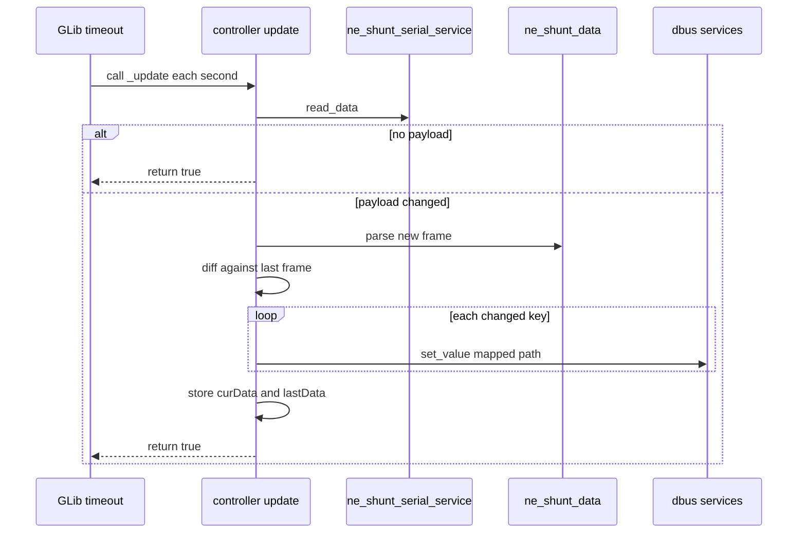
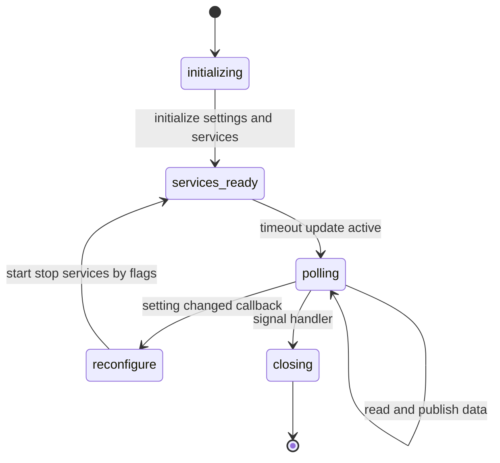

# dbus-ne-shunt Mermaid diagrams

## 1) Runtime architecture

## 2) Periodic update flow

## 3) Service lifecycle state

## Source anchors

- [src/opt/victronenergy/dbus-ne-shunt/__main__.py](../src/opt/victronenergy/dbus-ne-shunt/__main__.py)
- [src/opt/victronenergy/dbus-ne-shunt/ne_shunt_services_controller.py](../src/opt/victronenergy/dbus-ne-shunt/ne_shunt_services_controller.py)
- [src/opt/victronenergy/dbus-ne-shunt/serial_service/ne_shunt_serial_service.py](../src/opt/victronenergy/dbus-ne-shunt/serial_service/ne_shunt_serial_service.py)
- [src/opt/victronenergy/gui/qml/NeShuntOverview.qml](../src/opt/victronenergy/gui/qml/NeShuntOverview.qml)
