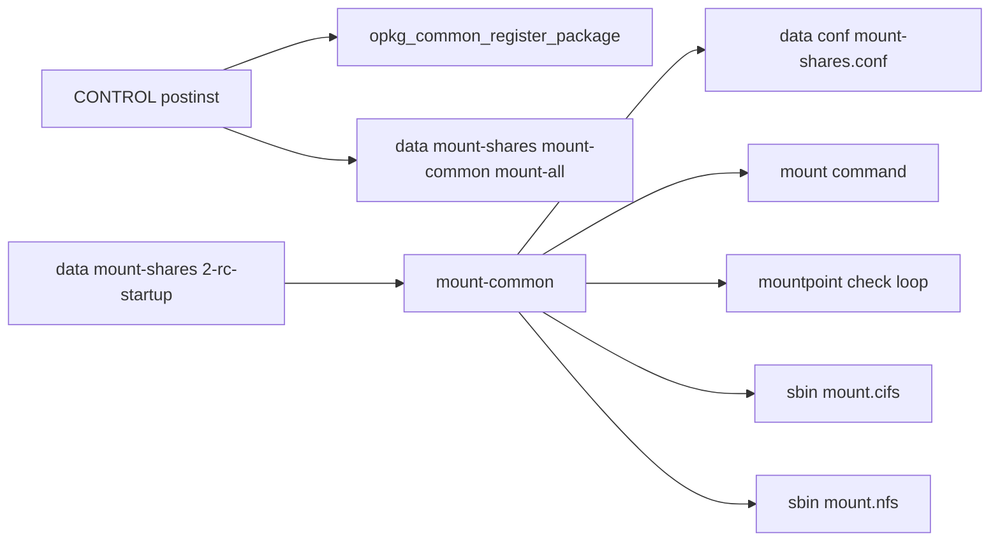
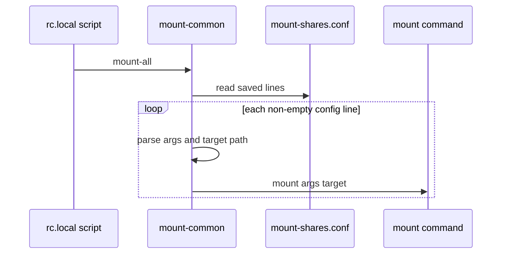

# mount-shares Mermaid diagrams

## 1) Runtime architecture

## 2) Mount all replay flow

## Source anchors

- [src/data/mount-shares/2-rc-startup](../src/data/mount-shares/2-rc-startup)
- [src/data/mount-shares/mount-common](../src/data/mount-shares/mount-common)
- [src/CONTROL/postinst](../src/CONTROL/postinst)
- [src/CONTROL/postrm](../src/CONTROL/postrm)
