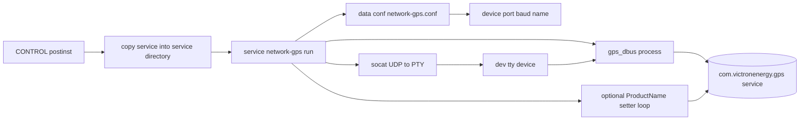
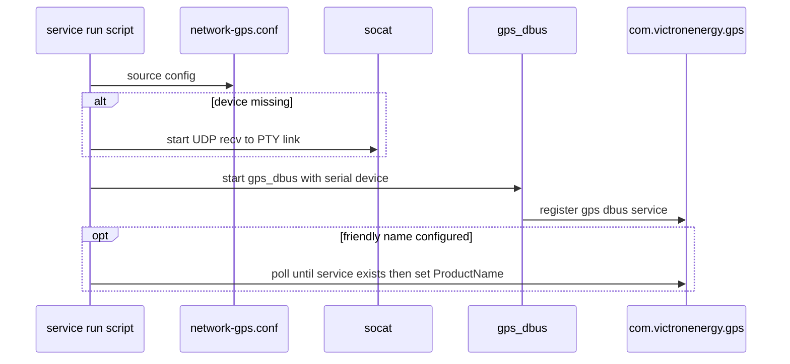

# network-gps Mermaid diagrams

## 1) Runtime architecture

## 2) Startup sequence

## Source anchors

- [src/opt/victronenergy/service/network-gps/run](../src/opt/victronenergy/service/network-gps/run)
- [src/data/conf/network-gps.conf](../src/data/conf/network-gps.conf)
- [src/CONTROL/postinst](../src/CONTROL/postinst)
- [src/CONTROL/prerm](../src/CONTROL/prerm)
