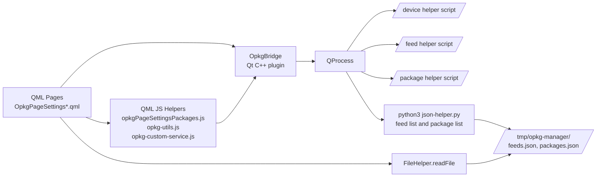
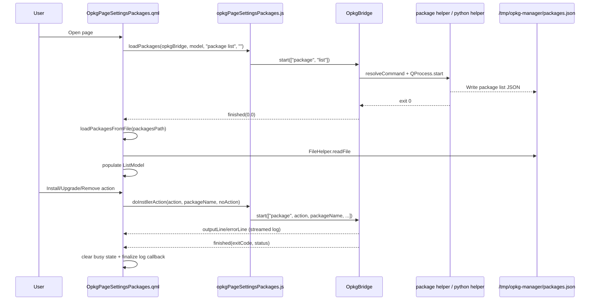
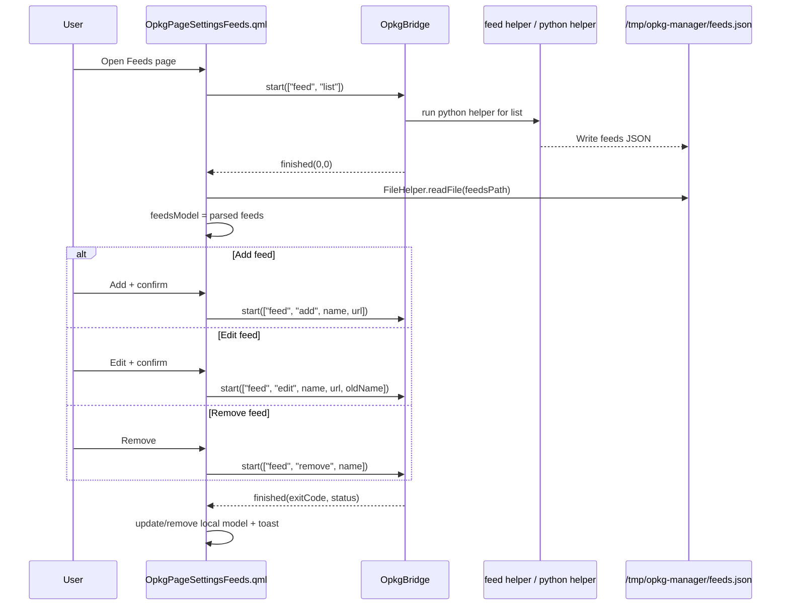
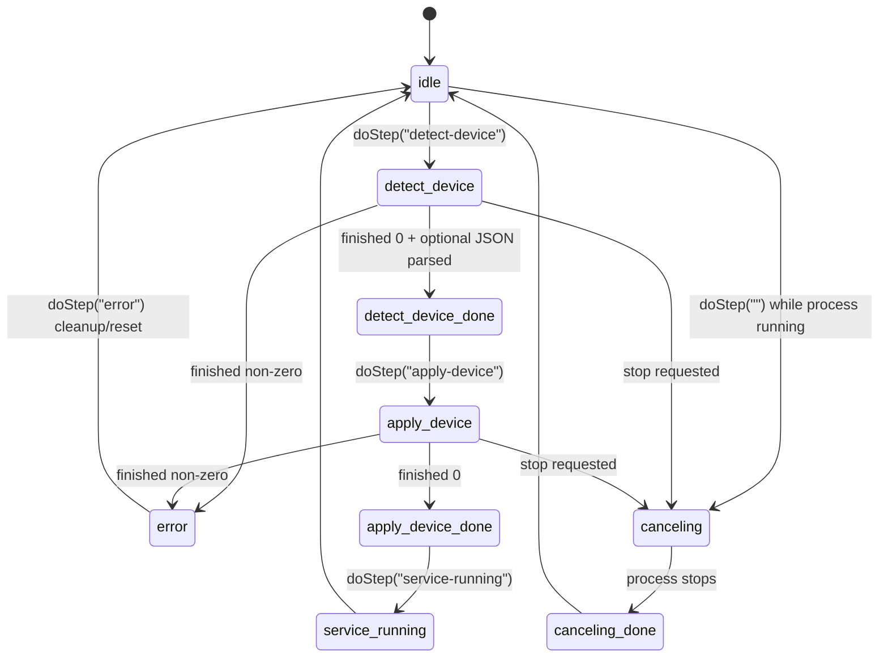

# opkg-manager Mermaid diagrams

This document captures code-level flows for the opkg-manager addon.

Related: [Installer Integration Patterns (Developer Note)](installer-integration-patterns.md)

## 1) High-level architecture

## 2) Package list/install/upgrade/remove flow

## 3) Feed management flow

## 4) Device setup step state machine

## Source anchors

- [src/opt/victronenergy/gui/qml/OpkgPageSettingsPackages.qml](../src/opt/victronenergy/gui/qml/OpkgPageSettingsPackages.qml)
- [src/opt/victronenergy/gui/qml/opkgPageSettingsPackages.js](../src/opt/victronenergy/gui/qml/opkgPageSettingsPackages.js)
- [src/opt/victronenergy/gui/qml/OpkgPageSettingsFeeds.qml](../src/opt/victronenergy/gui/qml/OpkgPageSettingsFeeds.qml)
- [src/opt/victronenergy/gui/qml/OpkgPageSettingsDeviceSetup.qml](../src/opt/victronenergy/gui/qml/OpkgPageSettingsDeviceSetup.qml)
- [src/qmlplugin/OpkgBridge.cpp](../src/qmlplugin/OpkgBridge.cpp)
- [src/data/opkg-manager/opkg-bridge/json-helper.py](../src/data/opkg-manager/opkg-bridge/json-helper.py)