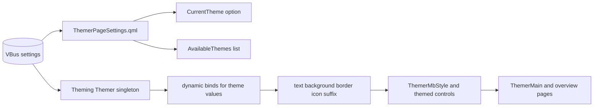
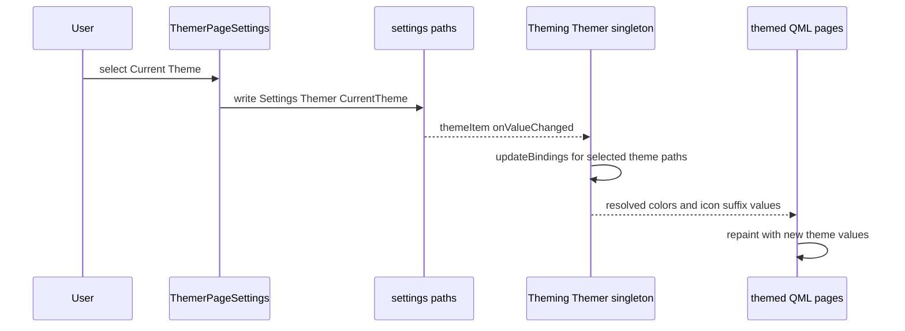

# themer Mermaid diagrams

## 1) Runtime architecture

## 2) Theme change propagation

## Source anchors

- [src/opt/victronenergy/gui/qml/ThemerPageSettings.qml](../src/opt/victronenergy/gui/qml/ThemerPageSettings.qml)
- [src/opt/victronenergy/gui/qml/ThemerPageSettingsSubMenu.qml](../src/opt/victronenergy/gui/qml/ThemerPageSettingsSubMenu.qml)
- [src/opt/victronenergy/gui/qml/Theming/Themer.qml](../src/opt/victronenergy/gui/qml/Theming/Themer.qml)
- [src/opt/victronenergy/gui/qml/ThemerMain.qml](../src/opt/victronenergy/gui/qml/ThemerMain.qml)
