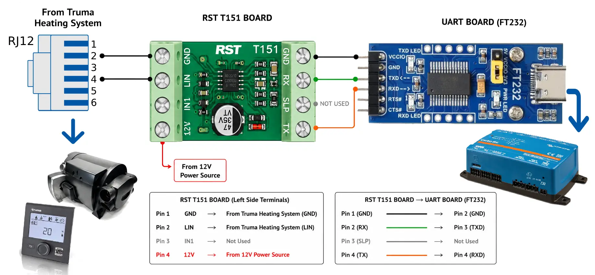
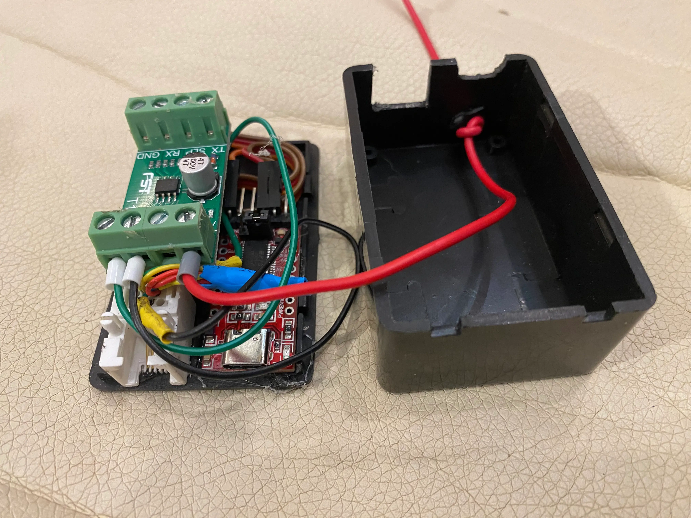

# Inetbox Hardware

In order for the Inetbox Service to function it needs some hardware to interface between the Truma heating system and the CerboGx/RasperryPi running the Venus OS.

On the Truma side the Heating control panel must be a Truma CP Plus (INet Ready) model

If you already have a TRUMA INet X box connected. This must be disconnected first. 

The hardware setup is very simple. You need a LIN>UART board and a USB>UART converter board, and an RJ12 cable (similar to an RJ11 cable but uses 6 wires not 2). Finally a case.

The recomended LIN board used is a RST T151.
The recomended UART board is a waveshare UART FT232 board.
  This board is based on a `Genuine' FTDI programable chip. While not a requirement, you can *optionaly* change the model name and other identification strings in the firmware. What is important, is the UART board is of good quality and provides a unique serial number. Cheaper boards (<$10) tend not to have unique serial numbers. This is not a problem, if you only have one USB UART device, but if you use more than one it makes it hard for the system to identify the correct device.

### Wiring Diagram
Below is the wiring diagram, if your lucky you can get away with no soldering.

The easiest way to connect the RJ12 cable to the Truma system is connecting it to the Truma Boiler. Usualy this is more accessable than the Truma CP control panel and often there is a spare RJ12 port. If no port is available then you can use an RJ12 splitter.

## Example Images

For the above hardware, the RJ12 Female socket was salvaged from an old ASDL Telephone filter.

--- 
#### Previous - [Overview](inetbox-overview.md)
#### Next - [Setup](inetbox-setup.md)

