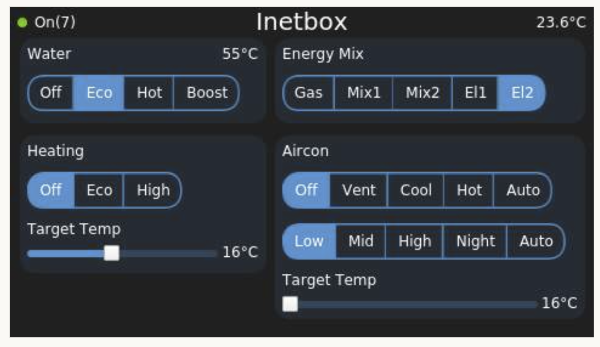

# Inetbox Overview

The Inetbox addon brings Truma Heating and Aircon control to the Venus OS.

The serial bus micropython code was adapted from the inetbox2mqqt project:
[inetbox2mqtt](https://github.com/mc0110/inetbox2mqtt)
Many thanks guys!

The Inetbox addon requires some hardwere inbetween the CerboBX/Raspbery PI.
See [Here](inetbox-hardware.md) for details

#### Dark Mode

---
#### Inetbox - [Hardware](inetbox-hardware.md)
