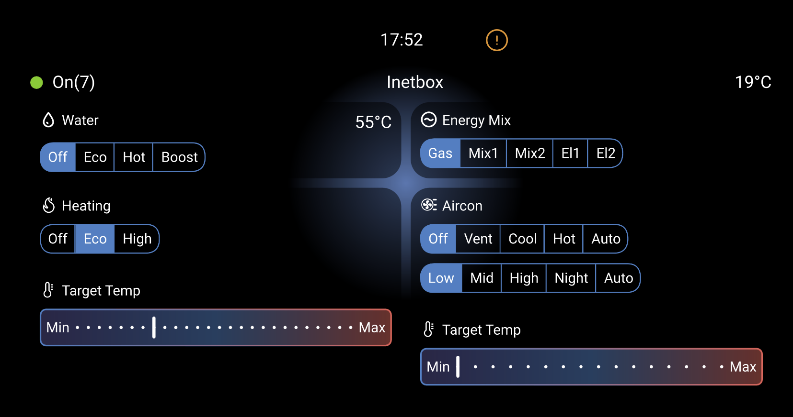
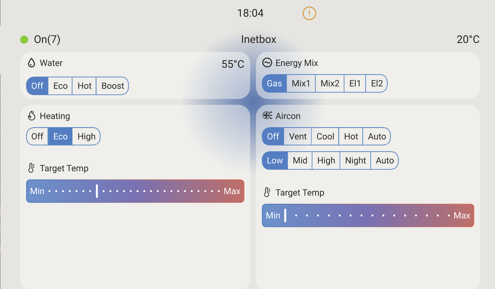

# Inetbox Overview

The Inetbox addon brings Truma Heating and Aircon control to the Venus OS.

The serial bus micropython code was adapted from the inetbox2mqqt project:
[inetbox2mqtt](https://github.com/mc0110/inetbox2mqtt)
Many thanks guys!

## Prerequisites

Install [Opkg Manager](opkg-manager-setup.md) first before using this add-on.

The Inetbox addon requires some hardwere inbetween the CerboBX/Raspbery PI.
See [Here](inetbox-hardware.md) for details

#### Gui-V2 - Dark Mode

#### Gui-V2 - Light Mode

#### Gui-V1 - Light Mode

#### Gui-V1 - Dark Mode

---
#### Inetbox - [Hardware](inetbox-hardware.md)
