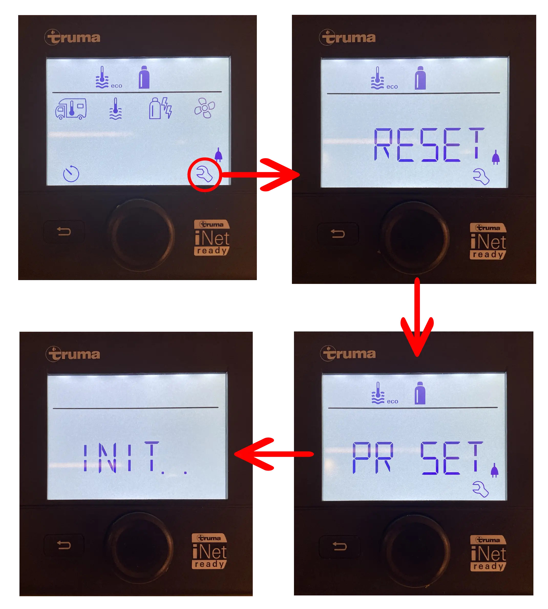
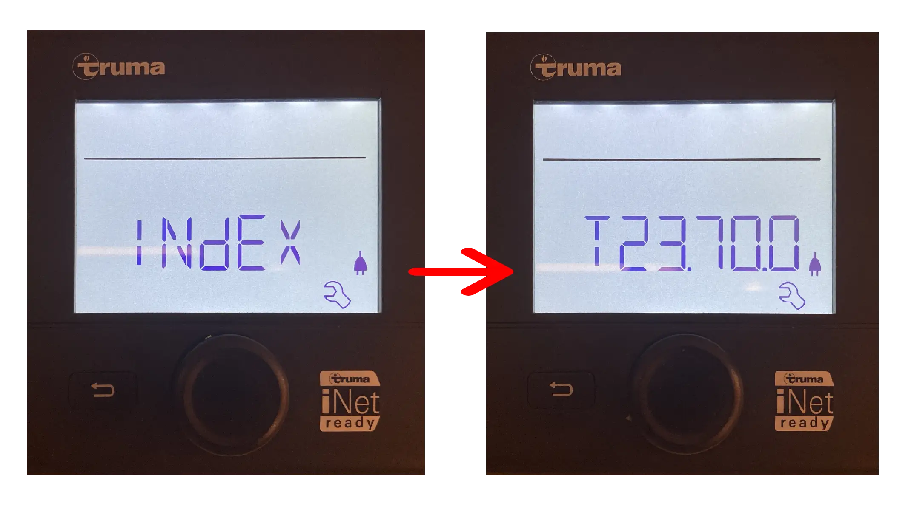
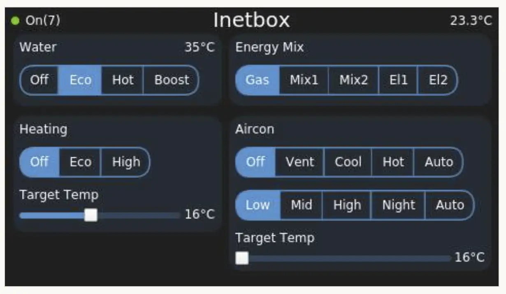

# Inetbox Setup

Before you begin, ensure the [hardware](inetbox-hardware.md) requirements are met.

It is recommended to install the add-on before plugging the Inetbox device into a USB port.

A prerequisite for setting up this add-on is the [Opkg Manager](opkg-manager-setup.md).

## Summary of Setup Steps

1. Confirm hardware requirements are met.
2. Install Opkg Manager.
3. Install the Inetbox package from Opkg Manager.
4. Use USB Serial Device Installer to detect the Inetbox USB device.
5. Click Apply to start the Inetbox service.
6. Complete registration on the Truma CP Plus panel.
7. Verify the device index and confirm data appears in Venus OS.

## Detailed Steps

Once Opkg Manager is installed, in Venus OS go to Menu/Settings/Open Package Manager/Packages and select the Inetbox package. Open the install screen and click Install.

Next, in Venus OS go to Menu/Settings/Open Package Manager/USB Serial Device Installer.
Click Detect and follow the instructions. You will be prompted to insert the USB device (your Inetbox hardware).

After the USB device is detected, click Apply. This starts the Inetbox service.

The final part is to register the device using the Truma CP Plus control panel.

On the panel, go to Settings (the spanner icon), scroll to the Reset menu, and press it. Press again when the screen displays PR SET.

Once the device is reset, verify by checking for a device with index "T23.700".

If all is well, you should be able to return to Venus OS and scroll through the Overview pages to Inetbox.

It can take a little time for the initial data to be received.
Each group on the Inetbox Overview page appears as the data arrives.

---
#### Previous - [Hardware](inetbox-hardware.md)
#### Next - [Usage](inetbox-usage.md)
