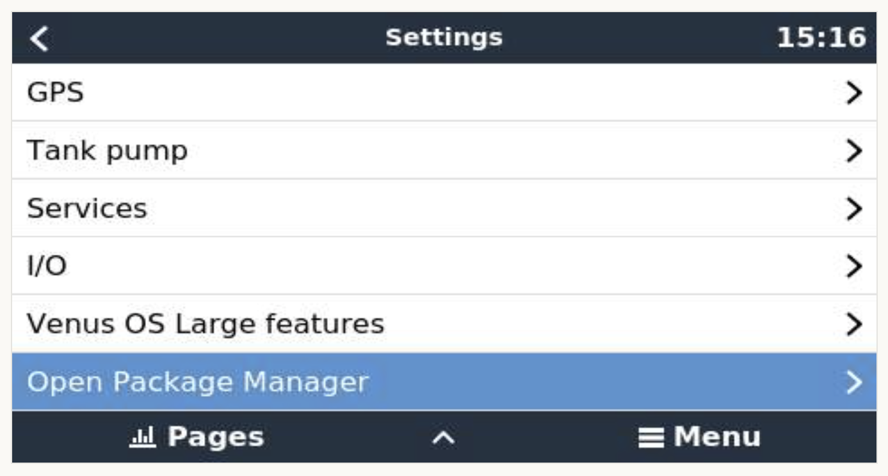

# Opkg Manager Installing

## SSH
To install via SSH execute the following command
 
```
opkg install https://thespinmaster.github.io/venus-os-addons/feeds/release/opkg-manager/opkg-manager-latest.ipk
```

## Blind Install Using Removable USB Memory
To install via usb drive or sd card
Format the device as FAT (not FAT32 or exFAT)
Download the file to the sd card:
[venus-data-opkg-manager-blind-install.tgz](https://thespinmaster.github.io/venus-os-addons/feeds/release/opkg-manager/venus-data-opkg-manager-blind-install.tgz)

Insert the usb device into the Cerbo GX or Raspberry Pi and reboot.

The blind-install archive can optionally use a config file named `venus-data-opkg-manager-blind-install.conf` next to `venus-data-opkg-manager-blind-install.tgz` on the USB drive.
If that file is present, it should use one directive per line, with comment lines starting with `#` ignored.
If the file is not present, the blind-install still continues with the default opkg-manager install.

Supported directives:

```
feed <feed-name> <feed-url>
package <action> [args ...] <package-name>
```

Example:

```
feed some-awesome-feed https://feedurl.com/feeds/release
package install [name of package to install]
package install --force-reinstall [name of package to install]
```

An example config file can be downloaded from here: [venus-data-opkg-manager-blind-install.conf.example](https://thespinmaster.github.io/venus-os-addons/feeds/release/opkg-manager/venus-data-opkg-manager-blind-install.conf.example)


## Installed
After installing there should be a menu item Open Package Manager under Menu/Settings




---
#### Previous - [Overview](opkg-manager-overview.md)
#### Next - [Usage](opkg-manager-usage.md)