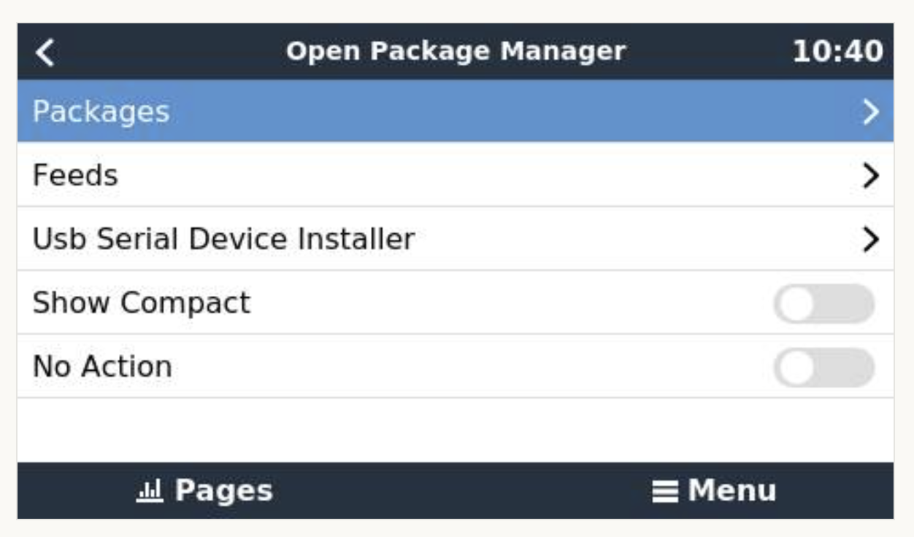

# Opkg Manager Overview

The Opkg Manager allows end users to install `opkg` packages (add-ons) on the Venus OS without the need for complex SSH shell commands. It also allows users to add custom feeds (sources) for add-ons created by third parties.

## What is Opkg?
Opkg (Open Package Management) is a compact package manager built for embedded Linux environments and Internet of Things (IoT) devices. Widely used in platforms such as OpenWrt routers, smart home controllers, and Yocto-based distributions, it provides functionality comparable to apt while maintaining a minimal memory footprint. Opkg comes pre-installed with Venus OS.

## USB Serial Device Installer
In addition to installing add-ons, the Opkg Manager also supports installing USB serial devices and services.

After selecting the service to use and connecting a USB device, the installer detects the device and starts the appropriate service.

## Menu Customization

Provides add-ons with the ability to add, remove, and reposition existing menus in the Venus OS without patching UI files. This is explained in more detail in the developer documentation, as it is transparent to the end user.

## Overview Page Customization
Provides add-ons with the ability to add, remove, or replace overview pages without patching UI files. This is also explained in more detail in the developer documentation, as it is transparent to the end user.

## New Firmware Updates
When a new Venus OS firmware version is installed, the Opkg Manager automatically downloads and reinstalls previously installed packages.

## Other Features
The Opkg Manager intentionally does not use the Linux `patch` command to modify shared UI files.

While `patch` is useful during development, it is a poor fit for production installers that must be reliable across many systems and firmware versions. Even minor changes in upstream files can cause a patch to fail or be applied to the wrong part of a file, and multiple add-ons patching the same file can conflict with each other. This makes installs and updates less predictable.

`patch` also does not provide package-level ownership of individual changes. That means uninstall and rollback behavior is harder to guarantee, especially when several packages have touched the same shared file over time.

Instead, Opkg Manager uses a custom `file-patcher` method for very small, controlled integration hooks at the end of UI files. These hook blocks are intentionally minimal and are designed to be applied and removed cleanly during install and uninstall. This keeps updates safer and rollback behavior predictable.

---
#### Next - [Installing](opkg-manager-installing.md)