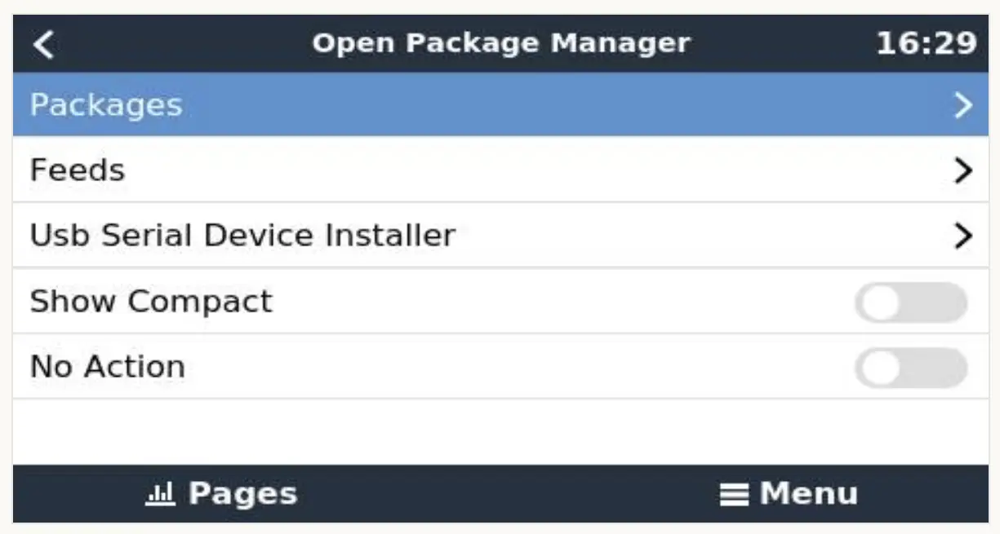
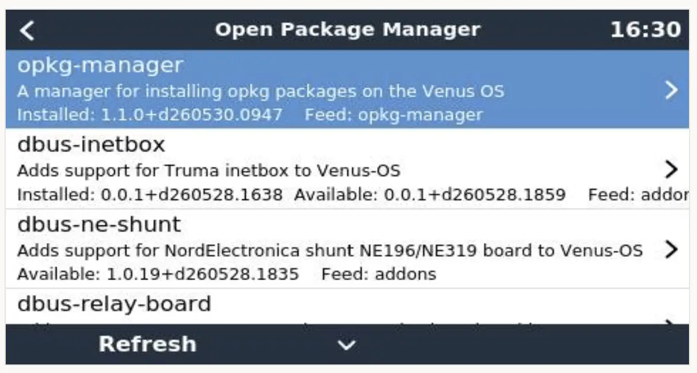
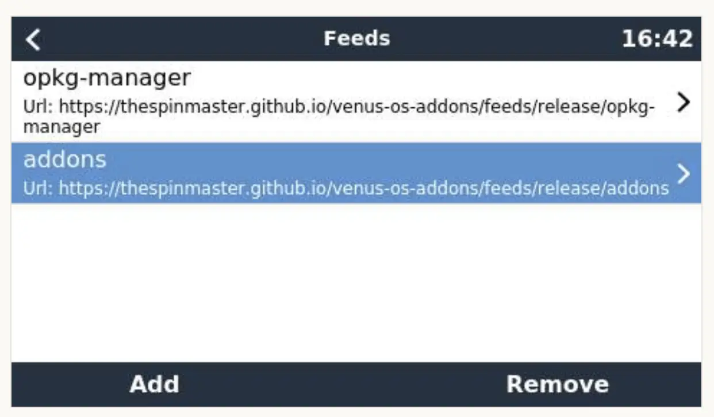

# Opkg Manager Usage

This guide walks you through the basic use of Opkg Manager, including how to manage packages and feeds, install USB serial devices, and safely preview changes before applying them.

### Packages
Use the Packages page to install, upgrade, reinstall, or remove add-ons.

Typical workflow:

1. Open `Menu -> Settings -> Open Package Manager`.
2. Open the **Packages** list.
3. Select a package to view details and available actions.
4. Choose the action you want (`install`, `upgrade`, `remove`, or `reinstall`).
5. Confirm the operation.

What to expect:

* Opkg Manager resolves dependencies before applying changes.
* If dependencies cannot be satisfied, the operation is blocked and an error is shown.
* Package scripts from the package itself can run during install/remove.

Tip: Enable **No Action** first to preview dependency resolution before making changes.
 
### Feeds
Feeds are package sources. The **Feeds** page lets you manage which repositories Opkg Manager uses.

Common feed tasks:

* Add a feed by providing a feed name and URL.
* Enable/disable a feed to include or exclude it from package searches.
* Remove a feed that is no longer needed.
* Refresh feed indexes so the package list reflects the latest available versions.

Recommendations:

* Prefer trusted release feeds for stable systems.
* Use development feeds only when testing and you are prepared for breakage.
* Keep the number of active feeds minimal to reduce conflicts between package versions.
 
### USB Serial Device Installer.
The USB Serial Device Installer helps you bind supported USB serial devices to the correct service.

Basic usage:

1. Open the **USB Serial Device Installer** page in Opkg Manager.
2. Select the service/driver profile you want to use. Only installed packages that include USB serial installer support appear in the selectable services list.
3. Click Detect Usb Device
4. Follow the on screen instructons, Connect the USB serial device.
5. Wait for detection and confirmation.

Detection notes (what the installer checks):

* The detected device port (for example `ttyUSB*` or `ttyACM*`).
* The USB properties needed by the selected service profile. 
* Whether the device is already in use, or if it is already in use by another service/process.

After detection, The Apply button will appear. Click Apply and the required configuration will be applied and the service should start.

If a device is not detected:

* Reconnect the device and try a different USB port.
* Verify the selected installer profile matches the device type.
* Check that any required package/service is installed.
 
### Show Compact
When toggled the Packages and Feeds lists show as compact single lines.

### No Action
When toggled and a package is installed/removed it will:

* Resolve dependencies 
* Check package availability 
* Show what would be installed, upgraded, or removed 
* Report any dependency or conflict errors 

But it will not:

* Install packages 
* Remove packages 
* Modify configuration files 
* Execute package scripts 
* Change the package database 

This is useful when you want to verify that an install or removal will succeed before committing changes, especially on embedded systems where storage space and package dependencies can be sensitive.

---
#### Previous - [Setup](opkg-manager-setup.md)